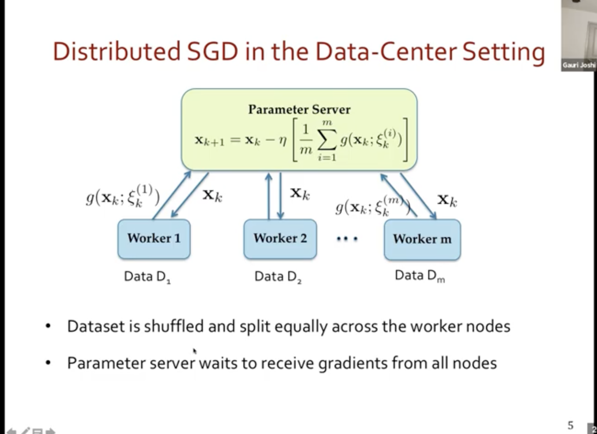

# Video Notes

<aside>
💡 Stochastic Gradient Descent

</aside>

before going for CEFL - check this page for plain vanialla SGD 

[https://towardsdatascience.com/stochastic-gradient-descent-explained-in-real-life-predicting-your-pizzas-cooking-time-b7639d5e6a32#:~:text=Stochastic Gradient Descent is a probabilistic approximation of Gradient Descent,gradient for the entire dataset](https://towardsdatascience.com/stochastic-gradient-descent-explained-in-real-life-predicting-your-pizzas-cooking-time-b7639d5e6a32#:~:text=Stochastic%20Gradient%20Descent%20is%20a%20probabilistic%20approximation%20of%20Gradient%20Descent,gradient%20for%20the%20entire%20dataset).

[https://scikit-learn.org/stable/modules/sgd.html](https://scikit-learn.org/stable/modules/sgd.html)

<aside>
📌 **SGD video Summary**

</aside>

Can be asynchronous but still server has to wait till the last node completes

Core communication efficient FL

- Below red line is model being pushed to the server rather than the data

Google and other cos are using the above setup

clients will perform their own SGD in local and 

large T - faster convergence, but large T and stuck to reach global minima

small T - smaller convergence

so Adaptive comm

performance of adaptive T strategy

Now, what if T varies across clients

intro to hetegenity in computation in FL

most of the algos disregard above in point 3

